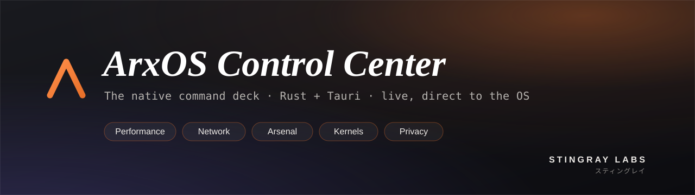
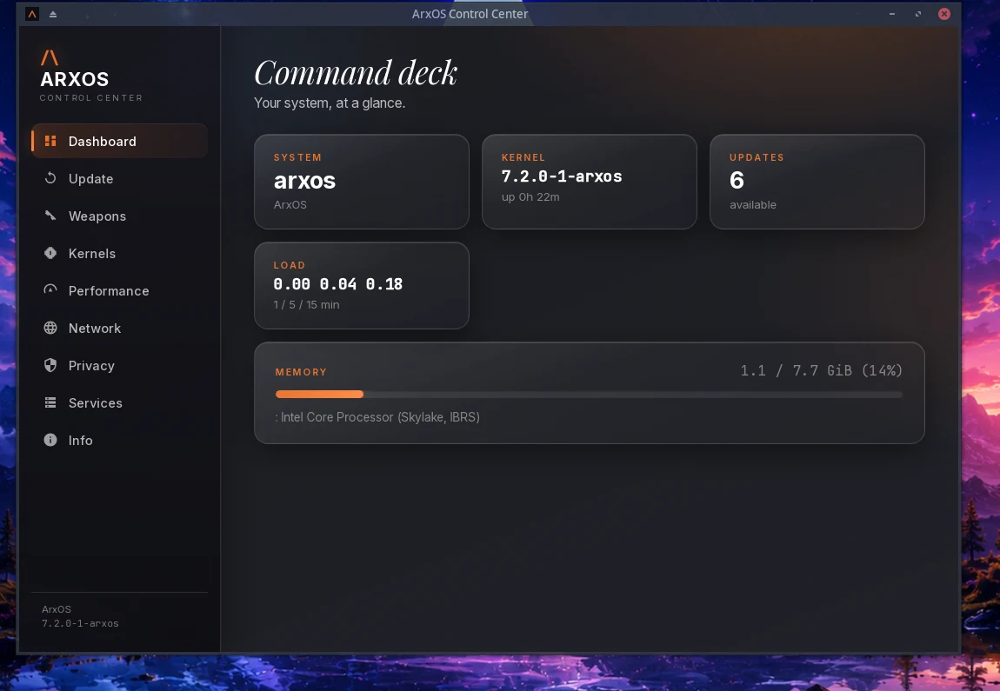
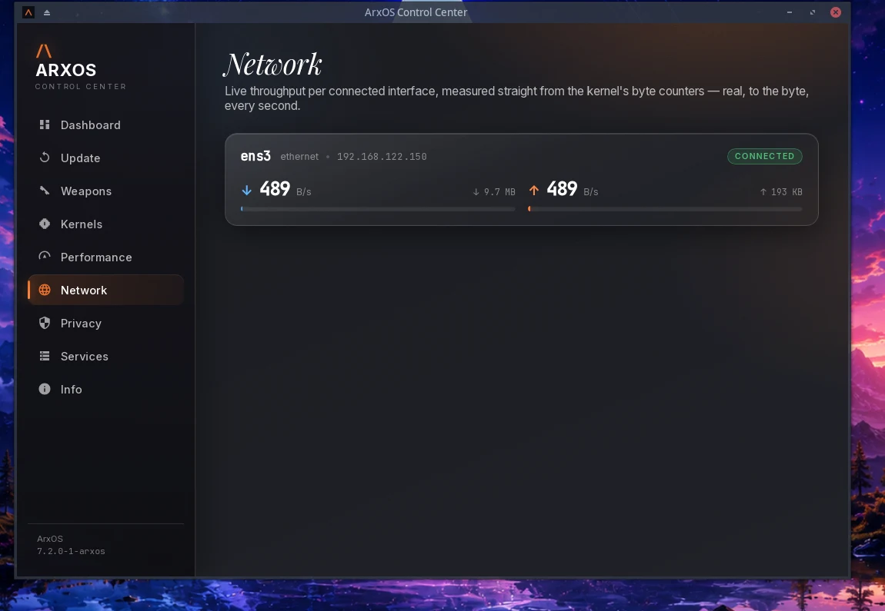
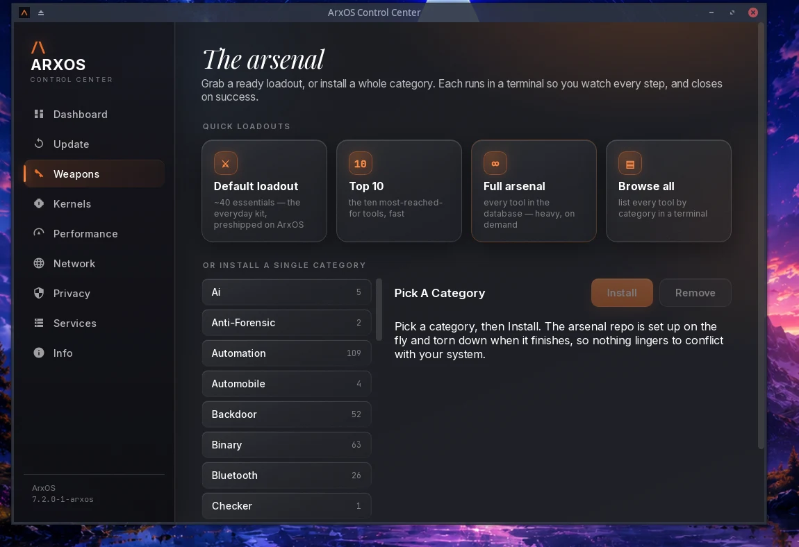
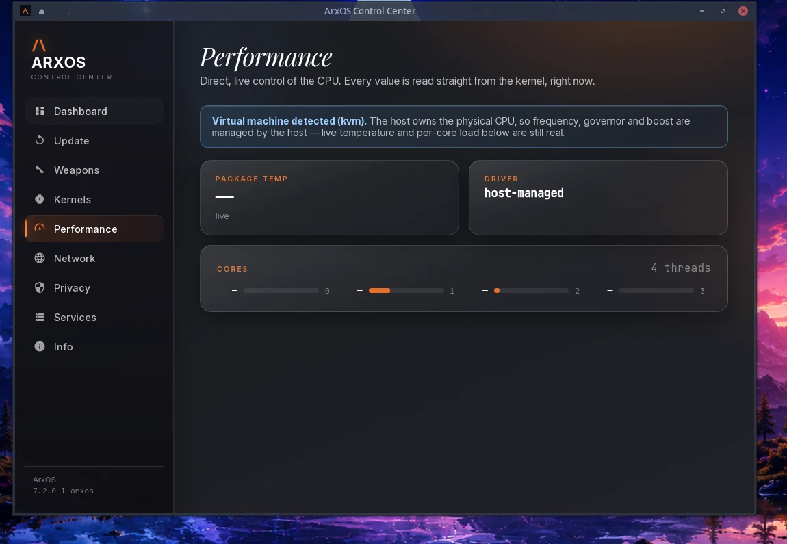

<div align="center">



<br>


**The native command deck for ArxOS.** One glass surface for the whole system: live stats, updates, the weapons arsenal, kernels, direct CPU control, live network, privacy, and services. Every panel talks straight to the real OS. Nothing is mocked.

</div>

---

## What it is

`arxctl` is the ArxOS Control Center, rebuilt native in **Rust + Tauri v2** with a glassmorphic ArxOS interface. It ships preinstalled on ArxOS, pinned to the Plank dock, and it is where every ArxOS specific feature lives. It is distributed as a **public binary with private source**, so nothing security sensitive leaks.

<table>
  <tr>
    <td width="50%" valign="top">
      <br>
      <b>Command deck.</b> The system at a glance: host, kernel, updates, load, memory, CPU, all live.
    </td>
    <td width="50%" valign="top">
      <br>
      <b>Network.</b> Live throughput per interface read straight from the kernel counters, plus listening ports with one click hardening (disable service or block the port).
    </td>
  </tr>
  <tr>
    <td width="50%" valign="top">
      <br>
      <b>The arsenal.</b> Ready loadouts (default, top 10, full) or any category, installed live. The repo is set up on the fly and torn down when it finishes.
    </td>
    <td width="50%" valign="top">
      <br>
      <b>Performance.</b> Direct, live CPU control from the kernel: governor, energy preference, boost, per core load. Detects a VM and degrades honestly.
    </td>
  </tr>
</table>

## Panels

- **Dashboard** live system summary.
- **Update** the system, the kernel and the ArxOS tools in one pass (hands off to a terminal running `arx`).
- **Weapons** the arsenal: quick loadouts and every category, installed live.
- **Kernels** pick, install and roll back ArxOS kernels, checksum verified.
- **Performance** governor, energy preference, turbo and per core load, straight from `/sys`.
- **Network** live per interface throughput, and listening ports with disable/block hardening.
- **Privacy** where anond (the ArxOS anonymity daemon) mounts, as a bundled binary.
- **Services** what is running.
- **Info** the machine.

## Install

arxctl ships preinstalled on ArxOS. To install it manually elsewhere:

```bash
git clone https://github.com/thearxos/arxctl-dist
cd arxctl-dist
bash install.sh
```

The installer downloads the prebuilt binaries from the public release, places the menu entry and the Plank dock item, and enables the update ping timer. It needs `webkit2gtk-4.1` at runtime.

## Build from source

```bash
cargo build --release --bin arxctl
```

The frontend is embedded at build time, so a UI change needs a rebuild.

---

<div align="center">


### Owned and built by Stingray Labs

**arxctl** is part of the **ArxOS** project. ArxOS and its tooling are developed by **Stingray Labs**.

<sub>スティングレイ</sub>

</div>
